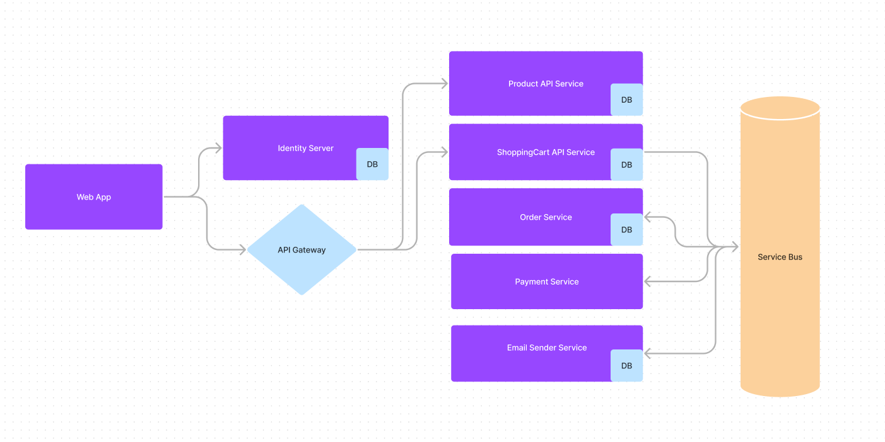

## Opis aplikacji

Aplikacja, którą napisałem ma umożliwić restauracji Parmezzan prowadzenie działalności przez Internet. Dzięki tej aplikacji restauracja ma możliwość zaprezentowania swojej oferty oraz prowadzenie sprzedaży.

Aplikacja umożliwia:
- rejestrację klientów oraz administratorów serwisu
- wyświelenie listy dostępnych produktów
- dodanie nowego produktu
- modyfikowanie produktu
- usunięcie produktu
- składanie zamówień
- pobieranie płatności
- wysyłanie wiadomości e-mail z potwierdzeniem płatności
- dodawanie produktów do koszyka
- obsługę koszyka dla każdego użytkownika
- usuwanie produktów z koszyka
- checkout 

## Schemat

## Architektura
Aplikacja składa się z 8 microservice'ów komunikujących się ze sobą za pośrednictwem REST API oraz szyny danych (rabbitMQ).

- *Parmezzan.Service.Web* - Aplikacja kliencka, wyświetlająca UI oraz umożliwiająca wykonywanie operacji.	
- *Parmezzan.Service.GatewaySolution* - Aplikacja pośrednicząca pomiędzy aplikacją kliencką a pozostałymi microservice'ami. Jej rolą jest odizolowanie reszty mikroserwisów od kwesti związanych z obsługą zapytań z aplikacji klienckiej. Przekierowuje zapytania z klienta do odpowiednich serwisów.
- *Parmezzan.Service.Identity* - Service Odpowiedzialny za rejestrację nowych użytkowników, logowanie oraz uwierzytelnianie istniejących.
 - *Parmezzan.Service.ProductAPI* - REST Api Service odpowiedzialny za obsługę produktów: zwrócenie listy produktów, dodanie nowego produktu, modyfikowanie, usuwanie istniejących produktów.
 - *Parmezzan.Service.ShoppingCartAPI* - REST Api Service odpowiedzialny za obsługę koszyka. Przechowuje wybrane produkty dla każdego użytkownika oraz umożliwia wykonywanie operacji na koszyku (edit, clear, checkout)
 - *Parmezzan.Service.OrderAPI* - Service odpowiedzialny za dodawanie oraz modyfikacje zamówień
 - *Parmezzan.Service.PaymentAPI* -  Service odpowiedzialny za przetworzenie płatności
 - *Parmezzan.Service.EmailSender* - Service odpowiedzialny za wysyłkę maili po wykonaniu danej operacji (aktualnie po płatności)
	
## Uruchomienie
Wymagania:
-   sql server
-   rabbitMQ (docker run -d --hostname my-rabbit --name some-rabbit -p 15672:15672 -p 5672:5672 rabbitmq:3-management )

Przed uruchomieniem projektu należy zmienić connectionstring (appsettings.json) oraz wykonać migracje dla poszczególnych microservice'ów:

-   Parmezzan.Service.ProductAPI
-   Parmezzan.Service.OrderAPI
-   Parmezzan.Service.ShoppingCartAPI
-   Parmezzan.Service.Identity
-   Parmezzan.Service.EmailSender

Po uruchomieniu projektu, aplikacja dodaje w bazie dwóch domyślnych użytkowników: 
-   Admin – login: admin1@gmail.com, hasło: Admin123* 
-   Klient – login: customer1@gmail.com, hasło: Customer123*

